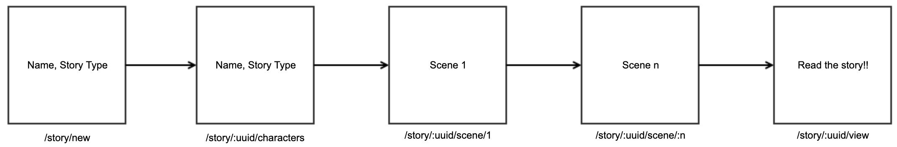

# Story Maker

A story builder application that allows kids to create creative stories with their own ideas.

## Building it with…
* Svelt on the FE
* Contentful to manage the story templates
* Mongo to store the stories
* Express for the APIs

## API

Start the API by:

1. `cd api`
2. `npm install`
3. `npm start`

_Note:_ We don't have source watching yet. If you'd like, run `npx nodemon index.js`

